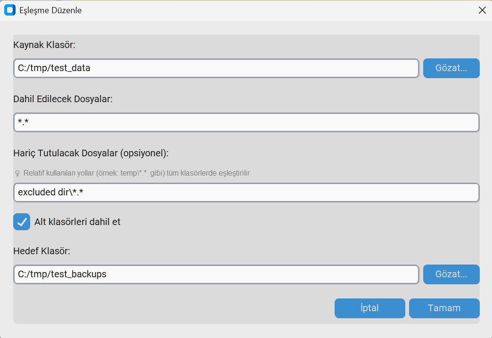
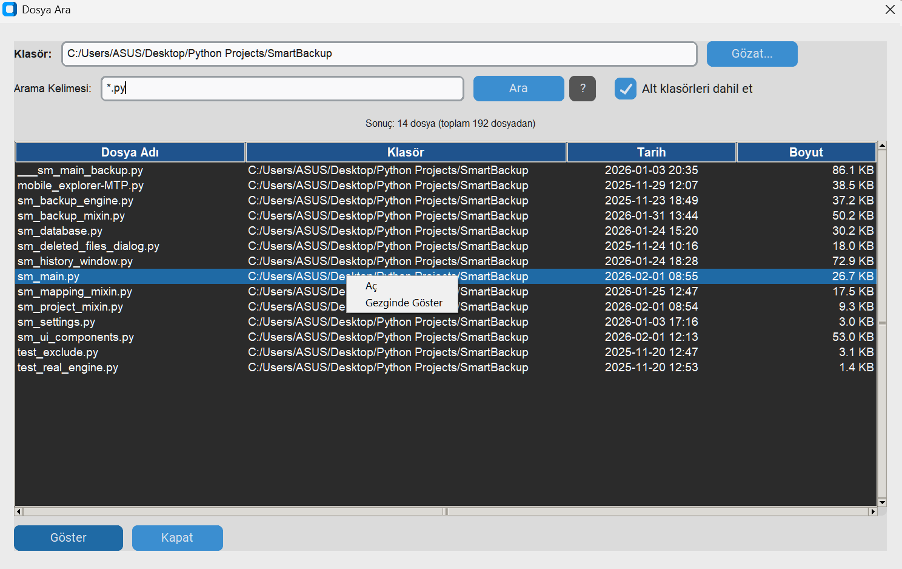
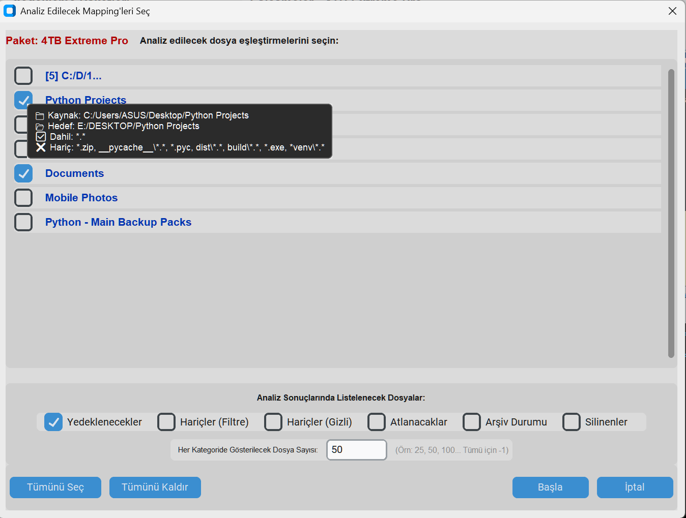
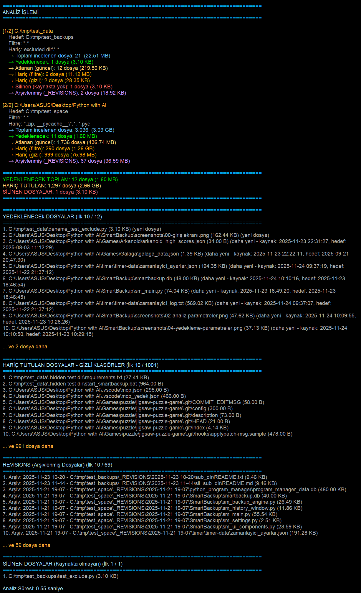
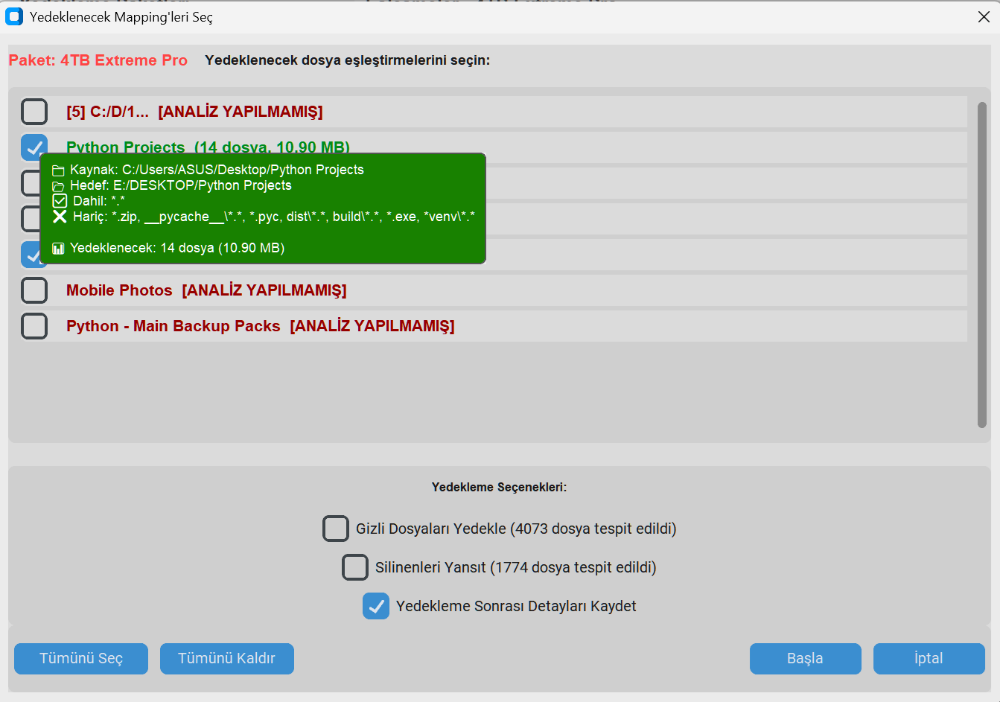
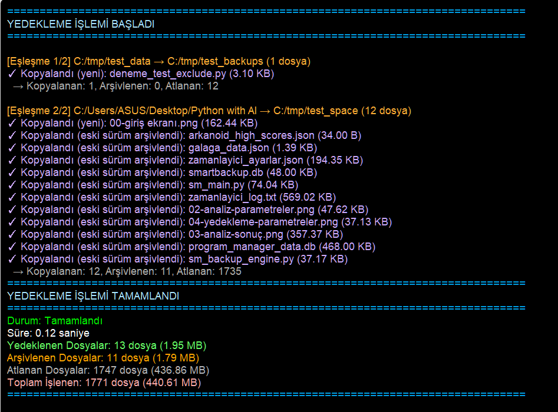
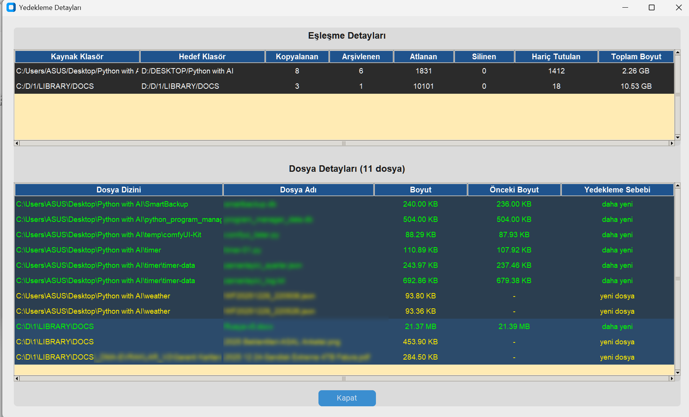
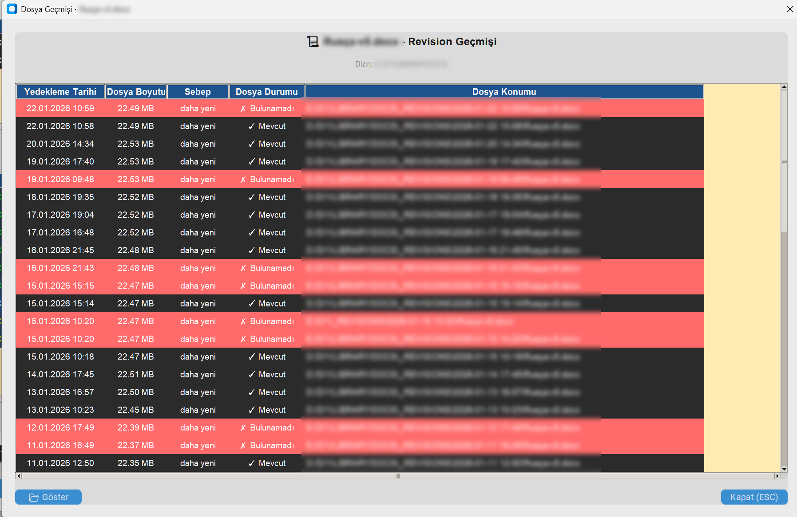
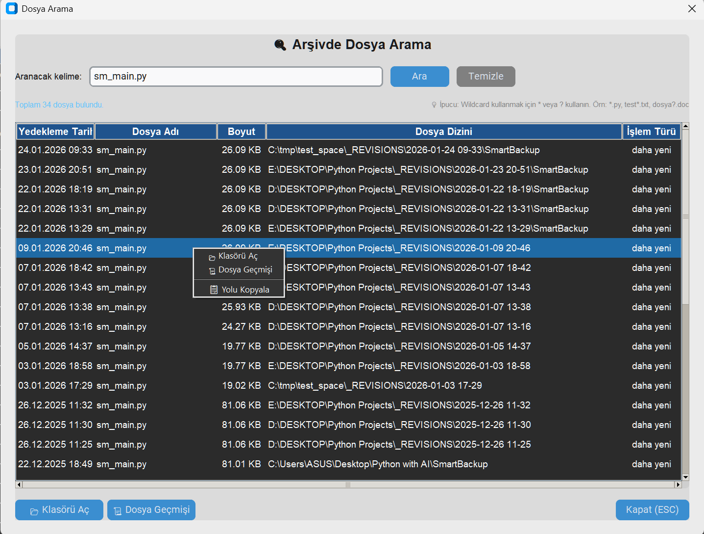

# Smart Backup - Akıllı Yedekleme Aracı


**Tarih:** 24 Ocak 2026  
**Yazar:** Dr. Mustafa Afyonluoğlu  
**Versiyon:** 2.1

---

## 📋 İçindekiler

- [Proje Hakkında](#proje-hakkında)
- [Özellikler](#özellikler)
- [Gerekli Kütüphaneler](#gerekli-kütüphaneler)
- [Kurulum](#kurulum)
- [Dosya Yapısı](#dosya-yapısı)
- [Kullanım Kılavuzu](#kullanım-kılavuzu)
- [Yedekleme Mantığı](#yedekleme-mantığı)
- [Veritabanı Şeması](#veritabanı-şeması)
- [Tema Desteği](#tema-desteği)
- [Kısayol Tuşları](#kısayol-tuşları)
- [Sorun Giderme](#sorun-giderme)
- [Lisans ve İletişim](#lisans-ve-iletişim)

---

## Proje Hakkında

Smart Backup, kullanıcının tanımladığı kaynak klasörlerdeki dosyaları hedef klasörlere kopyalayan ve kopyalanmış dosyaların eski versiyonlarını otomatik olarak arşivleyen profesyonel bir yedekleme aracıdır. CustomTkinter tabanlı modern bir arayüze sahiptir ve tüm ayarlarını SQLite veritabanında saklar.

### ✨ Neden Smart Backup?

- 🎯 **Proje Bazlı Yönetim**: Farklı yedekleme senaryoları için projeler oluşturun
- 🔄 **Akıllı Senkronizasyon**: Sadece değişen dosyalar kopyalanır
- 📁 **Versiyon Kontrolü**: Eski dosyalar otomatik arşivlenir
- 🎨 **Modern Arayüz**: CustomTkinter ile şık ve kullanıcı dostu tasarım
- 🔧 **Modüler Yapı**: Mixin Pattern ile organize edilmiş temiz kod

---


## Kurulum

⚠️ Windows installer ile programın doğrudan çalışan şeklini istediğiniz bir yere kurmak için `SmartBackupInstall.exe` dosyasını çalıştırnanız yeterlidir.


🎉Programı kaynak kodlardan en güncel şekli ile çalıştırmak için: 

1. Python'un bilgisayarınızda kurulu olduğu varsayılmıştır. Eğer yüklü değilse https://www.python.org/downloads/ adresinden indirin ve bilgisayarınıza kurun. 
- ⚠️Kurulumdan sonra windows `Ortam Değişkenleri` bölümündeki PATH tablosunda, python'u kurduğunuz yerin, tablonun en üstünde olduğunu kontrol edin.
2. Tüm proje dosyalarını bir klasöre kopyalayın.
3. Gerekli kütüphaneyi yükleyin:
   ```bash
   pip install customtkinter
   ```
- ✅ Python'u ilk kez kurduysanız ve bilgisayarınızda `pip` komutu çalışmıyorsa, windows **Ortam Değişkenleri** bölümünden `pip.exe` dosyasının bulunduğu klasörün `PATH` değişkeninde tanımlı olduğunu kontrol edin. (pip.exe, genelde Python'u kurduğunuz klasörün altındaki `SCRIPTS` klasörünün içindedir. Bu klasörü "ortam değişkenleri" sayfasında PATH bölümüne ilave etmeniz yeterli olacaktır.)

- ✅ python programının bilgisayarda nerede kurulu olduğunu şu komutla öğrenebilirsiniz:
   ```bash
   where python 
   ```

4. Ana programı çalıştırın:
   ```bash
   python sm_main.py
   ```
   
---


## Özellikler

### 🎯 Temel Özellikler

- **Proje Bazlı Yönetim**: Farklı yedekleme senaryoları için birden fazla proje oluşturabilirsiniz
- **Eşleşme Sistemi**: Her proje için istediğiniz sayıda kaynak-hedef eşleşmesi tanımlayabilirsiniz
- **Dosya Filtreleme**: `*.*`, `*.doc*`, `abc*.txt` gibi filtrelerle seçici yedekleme
- **Hariç Tutma Filtreleri**: `*.db`, `temp\*.*`, `__pycache__\*.*` gibi istenmeyen dosyaları hariç tutma
- **Alt Klasör Desteği**: İstediğiniz eşleşmelerde alt klasörleri dahil edebilir veya hariç tutabilirsiniz
- **Akıllı Yedekleme**: Sadece yeni veya değişen dosyalar kopyalanır
- **Otomatik Arşivleme**: Güncellenen dosyaların eski versiyonları `_REVISIONS` klasörüne otomatik taşınır
- **İlerleme Takibi**: Yedekleme sırasında detaylı ilerleme ve durum bilgisi
- **Geçmiş Yönetimi**: Tüm yedekleme işlemlerinin detaylı kaydı

### 📋 Eşleştirme Özellikleri



- **Kopyala/Yapıştır**: Eşleştirmeleri sağ tık menüsünden kopyalayıp başka projelere yapıştırabilirsiniz
- **Çoğaltma**: Mevcut eşleştirmeleri hızlıca çoğaltabilirsiniz
- **Klasör Erişimi**: Sağ tık ile kaynak, hedef veya revision klasörlerini doğrudan açabilirsiniz
- **Kaynak Klasörde Ara**: Eşleştirme üzerinde sağ tık yaparak kaynak klasörde dosya arama yapabilirsiniz
- **Splitter Paneli**: Eşleştirme listesi ile yedekleme detayları arasında ayarlanabilir splitter

### 🔎 Dosya Arama Özelliği



Smart Backup'ın güçlü dosya arama özelliği ile:

#### Kullanım Yöntemleri:
1. **Eşleştirme Üzerinden Arama**:
   - Eşleştirme listesinde bir satıra sağ tık yapın
   - "Kaynak Klasörde Ara" seçeneğini seçin
   - Arama penceresi otomatik olarak kaynak klasörü yükler

2. **Genel Klasör Aramasi**:
   - Ana ekranda "Klasörde Ara" düğmesine tıklayın
   - "Gözat..." ile istediğiniz klasörü seçin
   - Herhangi bir klasörde arama yapabilirsiniz

#### Arama Özellikleri:
- **Wildcard Desteği**: `*.txt`, `test*.py`, `*2024*.docx` gibi kalıplar kullanabilirsiniz
- **Çoklu Kelime Araması (AND)**: Birden fazla kelime yazarsanız, tüm kelimelerin geçtiği dosyalar bulunur (kelime sırası önemli değil)
- **Sıralı Kelime Araması**: Kelimeleri `"tırnak içinde"` yazarsanız, kelimeler o sırayla geçen dosyalar bulunur (aralarında başka kelimeler olabilir)
- **Hariç Tutma (-)**: Bir kelimenin başına `-` koyarsanız, o kelimeyi içermeyen dosyalar listelenir
- **Türkçe Karakter Desteği**: İ, I, Ş, Ğ, Ü, Ö, Ç gibi Türkçe karakterler için büyük/küçük harf duyarsız arama
- **Alt Klasör Kontrolü**: Alt klasörleri dahil etme/hariç tutma seçeneği
- **Detaylı Sonuçlar**: Dosya adı, klasör yolu, değiştirilme tarihi ve boyut bilgisi gösterilir
- **Sütun Sıralama**: Sütun başlıklarına tıklayarak listeyi o sütuna göre sıralayabilirsiniz (A-Z veya Z-A)
- **İstatistikler**: Bulunan dosya sayısı ve toplam taranan dosya sayısı gösterilir
- **Hızlı Erişim**: 
  - Sonuçlarda bir dosyaya çift tıklayarak Windows gezgininde açabilirsiniz
  - Veya "Göster" düğmesine tıklayarak seçili dosyayı gösterebilirsiniz
- **Sağ Tık Menüsü**:
  - **Aç**: Dosyayı Windows'daki varsayılan uygulama ile açar
  - **Gezginde Göster**: Dosyayı Windows gezgininde seçili olarak gösterir
- **Yardım Düğmesi (?)**: Arama özelliklerini açıklayan yardım mesajı

#### Örnek Aramalar:
- `*.pdf` - Tüm PDF dosyalarını bul
- `rapor` - İsminde "rapor" geçen tüm dosyaları bul
- `mustafa fatura` - Hem "mustafa" hem "fatura" geçen tüm dosyaları bul (sıra önemli değil)
- `"mustafa fatura"` - Önce "mustafa" sonra "fatura" geçen dosyaları bul (aralarında başka kelimeler olabilir)
- `rusça -özet` - "rusça" içeren ama "özet" içermeyen dosyaları bul
- `izmir` veya `İZMİR` - Türkçe karakter farkı olmadan aynı sonuç
- `2024*.xlsx` - 2024 ile başlayan tüm Excel dosyalarını bul
- `test?.txt` - test1.txt, test2.txt gibi dosyaları bul

### 🔍 Gelişmiş Analiz



Analiz işlemi sırasında aşağıdaki seçenekleri kontrol edebilirsiniz:
- ✅ **Yedeklenecek dosyalar**: Kaynakta yeni veya güncellenmiş dosyalar
- ✅ **Atlanan dosyalar**: Hedefte güncel olan dosyalar
- ✅ **Hariç tutulan dosyalar**: Kullanıcı filtreleri ile hariç tutulanlar
- ✅ **Gizli dosyalar**: Sistem tarafından hariç tutulan gizli dosyalar
- ✅ **Silinen dosyalar**: Kaynakta olmayan hedef dosyalar
- ✅ **Arşivlenmiş dosyalar**: _REVISIONS klasöründeki eski versiyonlar



### 💾 Yedekleme İşlemi



Yedekleme sırasında:
- Hangi eşleştirmelerin yedekleneceğini seçebilirsiniz
- Silinen dosyaları arşive taşıma seçeneği
- Gerçek zamanlı ilerleme takibi
- ESC tuşu ile güvenli iptal

### 🗑️ Silinen Dosya Yönetimi


Kaynakta artık bulunmayan dosyalar için:
- Detaylı liste görünümü
- Toplu veya tek tek seçim
- Filtreleme seçenekleri
- Arşive taşıma veya atlama

### 📊 Yedekleme Sonuçları



Her yedekleme sonrasında detaylı rapor:
- Kopyalanan dosya sayısı ve boyutu
- Arşivlenen dosya sayısı ve boyutu
- Atlanan ve silinen dosyalar
- İşlem süresi

### 📜 Geçmiş Yönetimi


- Tüm yedekleme işlemlerinin kaydı
- Kart ve tablo görünümü seçenekleri
- Detaylı istatistikler
- Geçmiş kayıtlarını silme
- **Dosya geçmişi görüntüleme** (revision history)



### 📜 Dosya Geçmişi (Revision History)

Smart Backup, yedekleme detayları penceresinden herhangi bir dosyanın geçmiş versiyonlarını görüntüleme imkanı sunar.

#### Dosya Geçmişini Görüntüleme 


1. **Geçmiş** butonuna tıklayarak yedekleme geçmişi penceresini açın
2. Bir yedekleme kaydına çift tıklayarak detay penceresini açın. (O anda erişilemeyen dosyaların satırları kırmızı renk ile işaretlenir. Bu bir USB disk ise USB cihazınızın bilgisayarınıza takılı olduğuna emin olun)
3. "Dosya Detayları" tablosunda görüntülemek istediğiniz dosyaya **sağ tıklayın**
4. Açılan menüden **"📜 Geçmişini Göster"** seçeneğini seçin

#### Dosya Geçmişi Penceresi

Açılan pencerede seçilen dosyanın `_REVISIONS` klasöründeki tüm eski versiyonları listelenir:

| Sütun | Açıklama |
|-------|----------|
| Revision Tarihi | Dosyanın arşivlendiği tarih ve saat |
| Dosya Boyutu | O anki dosya boyutu |
| Dosya Konumu | Revision dosyasının tam yolu |

#### Revision Dosyasını Açma

- Tabloda bir satıra **sağ tıklayıp "📂 Göster"** seçin, veya
- Satırı seçip **"Göster"** butonuna tıklayın
- Dosya Windows Explorer'da seçili olarak açılır

#### Örnek Kullanım Senaryosu

Diyelim ki `rapor.docx` dosyasının 3 gün önceki versiyonuna ihtiyacınız var:

```
1. Geçmiş penceresinden ilgili yedekleme kaydını bulun → çift tıklayın
2. Dosya Detayları tablosunda "rapor.docx" dosyasını bulun
3. Sağ tıklayıp "Geçmişini Göster" seçin
4. Açılan pencerede 3 gün önceki tarihi olan satırı bulun
5. "Göster" butonuna tıklayın → dosya Explorer'da açılır
6. Dosyayı kopyalayıp istediğiniz yere yapıştırabilirsiniz
```

> **Not:** Dosya geçmişi yalnızca daha önce yedekleme sırasında arşivlenmiş dosyalar için kullanılabilir. Yeni eklenen veya hiç güncellenmemiş dosyaların revision kaydı olmaz.

### 🔍 Yedekleme Geçmişinde Dosya Arama

Yedekleme geçmişi penceresinde **"🔍 Ara"** butonuna tıklayarak veritabanındaki tüm yedeklenmiş dosyalar ve revizyonları arasında arama yapabilirsiniz.



#### Arama Özellikleri

| Özellik | Açıklama |
|---------|----------|
| **Normal Arama** | Girilen kelimeyi içeren tüm dosya isimleri listelenir |
| **Wildcard Desteği** | `*` ve `?` karakterleri ile pattern araması (örn: `*.py`, `test*.txt`, `dosya?.doc`) |
| **Maksimum 200 Sonuç** | 200'den fazla eşleşme varsa ilk 200 gösterilir, toplam sayı belirtilir |
| **Sütun Sıralama** | Sütun başlıklarına tıklayarak artan/azalan sıralama |

#### Arama Sonuçları Tablosu

| Sütun | Açıklama |
|-------|----------|
| Yedekleme Tarihi | Dosyanın yedeklendiği veya revizyona aktarıldığı tarih |
| Dosya Adı | Dosyanın adı |
| Boyut | Dosyanın o kayıttaki boyutu |
| Dosya Dizini | Dosyanın bulunduğu hedef klasör yolu |
| İşlem Türü | Yedekleme sebebi (Yeni Dosya, Daha Yeni, vb.) |

#### Kullanım

1. **Geçmiş** butonuna tıklayarak yedekleme geçmişi penceresini açın
2. **"🔍 Ara"** butonuna tıklayın
3. Arama kutusuna dosya adını veya wildcard pattern girin
4. **Enter** tuşuna basın veya **"Ara"** butonuna tıklayın
5. Sonuç listesinde bir dosyaya **çift tıklayarak** veya **"📂 Klasörü Aç"** butonu ile hedef klasörü açın

#### Sağ Tık Menüsü

- **📂 Klasörü Aç**: Dosyanın yedeklendiği hedef klasörü Windows Explorer'da açar
- **📜 Dosya Geçmişi**: Dosyanın tüm revision geçmişini görüntüler
- **📋 Yolu Kopyala**: Dosyanın tam yolunu panoya kopyalar

#### Örnek Wildcard Kullanımları

| Pattern | Açıklama |
|---------|----------|
| `*.py` | Tüm Python dosyaları |
| `*.doc*` | Word dosyaları (.doc, .docx) |
| `rapor*.xlsx` | "rapor" ile başlayan Excel dosyaları |
| `test?.txt` | "test" + tek karakter + .txt uzantılı dosyalar |
| `*backup*` | Adında "backup" geçen tüm dosyalar |

> **İpucu:** Wildcard kullanmadan arama yaparsanız, girilen kelimeyi içeren tüm dosyalar listelenir. Örneğin "rapor" araması, "rapor.docx", "yillik_rapor.pdf", "rapor_2024.xlsx" gibi tüm dosyaları bulur.

### 🔍 Dosya Arama

Herhangi bir eşleştirmede tanımladığınız kaynak klasörde veya kendi vereceğiniz herhangi bir klasörde dosya araması yapabilirsiniz.


#### Yöntem 1: Eşleştirme Üzerinden

1. Eşleştirme listesinde bir satıra sağ tık yapın
2. "Kaynak Klasörde Ara" seçeneğini seçin
3. Arama penceresi otomatik olarak kaynak klasörü yükler

#### Yöntem 2: Genel Arama

1. Ana ekranda "Klasörde Ara" düğmesine tıklayın
2. "Gözat..." ile istediğiniz klasörü seçin
3. Herhangi bir klasörde arama yapabilirsiniz

### 🎨 Kullanıcı Arayüzü

- Modern ve kullanıcı dostu CustomTkinter arayüz
- Light, Dark ve System tema desteği
- Esnek pencere boyutlandırma (ayarlar hatırlanır)
- Ayarlanabilir splitter pozisyonu (kaydedilir)
- ESC tuşu ile tüm pencereleri kapatabilme
- Ekranda ortalanmış dialoglar
- Responsive tasarım

### 💾 Veritabanı

- SQLite tabanlı veri yönetimi
- Projeler, eşleşmeler, yedekleme geçmişi ve ayarlar veritabanında saklanır
- Cascade delete ile ilişkili verilerin otomatik silinmesi
- Veritabanı dosyası program dizininde otomatik oluşturulur
- Analiz seçimlerinin kayıt altına alınması

---

## Gerekli Kütüphaneler

Programı çalıştırmak için aşağıdaki kütüphanelerin yüklü olması gerekir:

```bash
pip install customtkinter
```

Standart kütüphaneler (kurulum gerektirmez):
- `tkinter`
- `sqlite3`
- `os`
- `shutil`
- `glob`
- `datetime`
- `pathlib`
- `threading`
- `time`
- `fnmatch`
- `webbrowser`

---


## Dosya Yapısı

```
SmartBackup/
│
├── sm_main.py              # Ana uygulama dosyası (giriş noktası)
├── sm_project_mixin.py     # Proje işlemleri mixin'i
├── sm_mapping_mixin.py     # Eşleştirme işlemleri mixin'i
├── sm_backup_mixin.py      # Yedekleme işlemleri mixin'i
├── sm_database.py          # Veritabanı yöneticisi
├── sm_settings.py          # Ayarlar yöneticisi
├── sm_backup_engine.py     # Yedekleme motoru
├── sm_ui_components.py     # UI bileşenleri (dialog'lar)
├── sm_history_window.py    # Geçmiş penceresi
├── sm_deleted_files_dialog.py  # Silinen dosyalar dialogu
├── sm_help.html            # Yardım dosyası
├── smartbackup.db          # SQLite veritabanı (otomatik oluşturulur)
├── requirements.txt        # Bağımlılıklar
├── start_smartbackup.bat   # Windows başlatma scripti
├── README.md               # Bu dosya
├── KULLANIM_KILAVUZU.md    # Detaylı kullanım kılavuzu
└── screenshots/            # Ekran görüntüleri
    ├── 00-giriş ekranı.png
    ├── 01-eşleştirme.png
    ├── 02-analiz-parametreler.png
    ├── 03-analiz-sonuç.png
    ├── 04-yedekleme-parametreler.png
    ├── 05-Silinen Dosyalar.png
    ├── 06-yedekleme-sonuç.png
    ├── 07-yedekleme geçmişi.png
    ├── 08-history-kart görünüm.png
    └── 09-history-detay.png
    └── 10-file-history-detay.png
```

### 🧩 Modül Yapısı (Mixin Pattern)

Program, kod organizasyonu için **Mixin Pattern** kullanır. Bu sayede ana dosya küçük ve yönetilebilir kalırken, işlevsellik mantıksal gruplara ayrılmıştır:

#### `sm_main.py` (Ana Modül)
Ana uygulama sınıfı ve widget oluşturma:
- `SmartBackupApp` sınıfı (ProjectMixin, MappingMixin, BackupMixin'den miras alır)
- Ana pencere ve UI düzeni
- Tema değiştirme ve splitter yönetimi
- Log paneli işlemleri

#### `sm_project_mixin.py` (Proje Mixin)
Proje yönetimi işlemleri:
- `_load_projects`: Projeleri listele
- `_add_project`: Yeni proje ekle
- `_edit_project`: Proje düzenle
- `_delete_project`: Proje sil
- `_duplicate_project`: Proje çoğalt
- `_show_project_context_menu`: Sağ tık menüsü

#### `sm_mapping_mixin.py` (Eşleştirme Mixin)
Eşleştirme yönetimi işlemleri:
- `_load_mappings`: Eşleştirmeleri listele
- `_add_mapping`: Yeni eşleştirme ekle
- `_edit_mapping`: Eşleştirme düzenle
- `_delete_mapping`: Eşleştirme sil
- `_duplicate_mapping`: Eşleştirme çoğalt
- `_copy_mapping`: Eşleştirmeyi panoya kopyala
- `_paste_mapping`: Panodan yapıştır
- `_open_source_folder`: Kaynak klasörü aç
- `_open_target_folder`: Hedef klasörü aç
- `_open_revisions_folder`: Revision klasörü aç

#### `sm_backup_mixin.py` (Yedekleme Mixin)
Yedekleme ve analiz işlemleri:
- `_calculate`: Dosya sayısı ve boyut hesapla
- `_analyze`: Detaylı analiz yap
- `_backup`: Yedekleme işlemini başlat
- `_save_backup_file_details`: Yedekleme detaylarını kaydet
- `_show_history`: Geçmiş penceresini aç

#### `sm_database.py`
Veritabanı işlemlerini yönetir:
- SQLite bağlantısı ve tablo oluşturma
- Proje CRUD işlemleri
- Eşleşme CRUD işlemleri
- Yedekleme geçmişi kaydetme ve okuma
- Ayarları kaydetme ve okuma
- Analiz seçimlerini kaydetme

#### `sm_settings.py`
Uygulama ayarlarını yönetir:
- Tema ve görünüm modu
- Pencere boyutu
- Son seçilen proje
- Splitter pozisyonu
- Varsayılan değerler

#### `sm_backup_engine.py`
Yedekleme işlemlerinin çekirdek mantığını içerir:
- Dosya listesi oluşturma (glob ile filtreleme)
- Hariç tutma filtrelerinin uygulanması
- İstatistik hesaplama
- Detaylı analiz (yedeklenecek, atlanan, silinen dosyaları belirleme)
- Yedekleme işlemi
- _REVISIONS klasörü yönetimi
- Boyut formatlama

#### `sm_ui_components.py`
Yeniden kullanılabilir UI bileşenleri:
- `ProjectDialog`: Proje ekleme/düzenleme
- `MappingDialog`: Eşleşme ekleme/düzenleme
- `ProgressDialog`: İlerleme göstergesi
- `BackupSelectionDialog`: Yedekleme seçim dialogu
- `AnalysisSelectionDialog`: Analiz seçim dialogu
- `ConfirmDialog`: Mesaj kutuları

#### `sm_deleted_files_dialog.py`
Silinen dosyalar yönetimi:
- Filtreleme ve seçim
- Toplu işlemler
- Detaylı liste görünümü

#### `sm_history_window.py`
Yedekleme geçmişi penceresi:
- Tablo ve kart görünümü
- Tüm yedekleme kayıtlarını listeleme
- Detayları görüntüleme
- Kayıt silme

---

## Kullanım Kılavuzu

### 1. Proje Oluşturma

1. Sol panelden **Yeni Proje** butonuna tıklayın
2. Proje adı ve açıklama girin
3. **Tamam**'a tıklayın

💡 **İpucu**: Projeler sağ tıklanarak çoğaltılabilir.

### 2. Eşleşme Ekleme

1. Sol panelden bir proje seçin
2. **Yeni Eşleşme** butonuna tıklayın
3. Kaynak klasörü seçin (Gözat butonu ile)
4. Dosya filtresini girin (örn: `*.*` tüm dosyalar, `*.docx` sadece Word dosyaları)
5. Hariç tutulacak dosyaları girin (opsiyonel, örn: `*.db, temp\*.*`)
6. Alt klasörlerin dahil edilip edilmeyeceğini seçin
7. Hedef klasörü seçin
8. **Tamam**'a tıklayın

💡 **İpucu**: Eşleştirmeler sağ tıklanarak kopyalanıp başka projelere yapıştırılabilir.

### 3. Hesaplama

Seçili projedeki tüm eşleşmelerde kaç dosya ve ne kadar boyut olduğunu görmek için **Hesapla** butonuna tıklayın.

### 4. Analiz

Hedef klasörde olmayan veya daha yeni olan dosyaların sayısını ve boyutunu görmek için **Analiz** butonuna tıklayın.

Analiz seçenekleri:
- Hangi eşleştirmelerin analiz edileceği
- Görüntüleme seçenekleri (yedeklenecekler, atlananlar, hariç tutulanlar, silinenler)
- Maksimum gösterilecek dosya sayısı

### 5. Yedekleme

1. **Yedekle** butonuna tıklayın
2. Yedeklenecek eşleştirmeleri seçin
3. Silinen dosyalar için tercihinizi belirleyin
4. Onay verin
5. İşlem sırasında:
   - İlerleme çubuğu gösterilir
   - O anda kopyalanan dosya görüntülenir
   - İstatistikler güncellenir
   - ESC tuşu ile iptal edebilirsiniz (onay gerekir)

### 6. Geçmiş Görüntüleme

1. **Geçmiş** butonuna tıklayın
2. Tüm yedekleme işlemlerini listede görebilirsiniz
3. Bir kayda çift tıklayarak detaylarını görebilirsiniz
4. **Seçili Kaydı Sil** ile geçmişten kayıt silebilirsiniz

---

## Yedekleme Mantığı

### Dosya Karşılaştırma

Smart Backup, kaynak ve hedef dosyaları karşılaştırırken şu mantığı kullanır:

1. **Hedefte dosya yoksa**: Dosya direkt kopyalanır
2. **Hedefte dosya var ve daha eski**: 
   - Hedefdeki eski dosya `_REVISIONS\YYYY-MM-DD HH-NN` klasörüne taşınır
   - Kaynak dosya hedefe kopyalanır
3. **Hedefte dosya var ve aynı/daha yeni**: Dosya atlanır
4. **Kaynakta dosya yok, hedefte var**: Silinen dosya olarak işaretlenir (opsiyonel arşivleme)

### _REVISIONS Klasörü

Güncellenen her dosyanın eski versiyonu, hedef klasörün içinde otomatik oluşturulan bir _REVISIONS klasöründe saklanır:

```
Hedef/
├── dosya1.txt
├── dosya2.doc
└── _REVISIONS/
    └── 2026-01-03 14-30/
        ├── dosya1.txt  (eski versiyon)
        └── klasor/
            └── dosya3.pdf  (eski versiyon)
```

### Hariç Tutma Filtreleri

Hariç tutma filtreleri çeşitli şekillerde tanımlanabilir:

- `*.db` - Tüm .db uzantılı dosyalar
- `temp\*.*` - temp klasöründeki tüm dosyalar (her seviyede)
- `__pycache__\*.*` - Tüm __pycache__ klasörleri
- `*.log, *.tmp` - Birden fazla pattern (virgülle ayrılmış)

---

## Veritabanı Şeması

### projects
| Kolon | Açıklama |
|-------|----------|
| `id` | Proje ID (Primary Key) |
| `name` | Proje adı (Unique) |
| `description` | Açıklama |
| `created_date` | Oluşturulma tarihi |
| `last_modified` | Son değiştirilme tarihi |

### mappings
| Kolon | Açıklama |
|-------|----------|
| `id` | Eşleşme ID (Primary Key) |
| `project_id` | Proje ID (Foreign Key) |
| `source_path` | Kaynak klasör |
| `file_filter` | Dosya filtresi |
| `exclude_filter` | Hariç tutma filtresi |
| `include_subdirs` | Alt klasörleri dahil et (0/1) |
| `target_path` | Hedef klasör |
| `created_date` | Oluşturulma tarihi |

### backup_history
| Kolon | Açıklama |
|-------|----------|
| `id` | Yedekleme ID (Primary Key) |
| `project_id` | Proje ID (Foreign Key) |
| `backup_date` | Yedekleme tarihi |
| `analysis_duration_seconds` | Analiz süresi (saniye) |
| `duration_seconds` | Yedekleme süresi (saniye) |
| `total_files_copied` | Kopyalanan dosya sayısı |
| `total_files_moved_to_revisions` | Arşivlenen dosya sayısı |
| `total_files_skipped` | Atlanan dosya sayısı |
| `total_files_deleted` | Silinen dosya sayısı |
| `total_files_excluded` | Hariç tutulan dosya sayısı |
| `total_size_copied` | Kopyalanan toplam boyut |
| `total_size_moved` | Arşivlenen toplam boyut |
| `total_size_skipped` | Atlanan toplam boyut |
| `total_size_deleted` | Silinen toplam boyut |
| `total_size_excluded` | Hariç tutulan toplam boyut |
| `status` | Durum (Tamamlandı/İptal Edildi) |

### settings
| Kolon | Açıklama |
|-------|----------|
| `key` | Ayar anahtarı (Primary Key) |
| `value` | Ayar değeri |

### analysis_selections
| Kolon | Açıklama |
|-------|----------|
| `project_id` | Proje ID |
| `mapping_id` | Eşleştirme ID |
| `is_selected` | Seçili mi (0/1) |

---

## Tema Desteği

Uygulama, CustomTkinter'ın sunduğu 3 tema modunu destekler:

| Tema | Açıklama |
|------|----------|
| **Light** | Açık tema |
| **Dark** | Koyu tema |
| **System** | Sistem temasını takip eder |

Tema tercihiniz otomatik olarak kaydedilir ve program bir sonraki açılışta hatırlanır.

---

## Kısayol Tuşları

| Tuş | İşlev |
|-----|-------|
| **ESC** | Aktif pencereyi kapat / İşlemi iptal et |
| **Çift Tıklama** | Eşleşmeyi düzenle / Geçmiş detaylarını göster |
| **Sağ Tık** | Context menüyü aç |

---

## Güvenlik ve Veri Bütünlüğü

- ✅ Tüm veritabanı işlemleri transaction-safe
- ✅ Cascade delete ile veri tutarlılığı korunur
- ✅ Dosya kopyalama sırasında `shutil.copy2` kullanılarak metadata korunur
- ✅ İptal edilen işlemler veritabanına "İptal Edildi" olarak kaydedilir
- ✅ Harici disk erişilebilirlik kontrolü

---

## Teknik Detaylar

| Özellik | Teknoloji |
|---------|-----------|
| **UI Framework** | CustomTkinter (modern, responsive) |
| **Veritabanı** | SQLite3 (dosya bazlı, kurulum gerektirmez) |
| **Threading** | Yedekleme işlemleri arka planda, UI donmaz |
| **Dosya İşlemleri** | os, shutil, glob, fnmatch modülleri |
| **Tarih/Saat** | datetime modülü ile ISO formatında |
| **Mimari** | Mixin Pattern ile modüler yapı |

---

## Sorun Giderme

### ❌ Program açılmıyor
- Python 3.2+ sürümünü kullandığınızdan emin olun
- `customtkinter` kütüphanesinin yüklü olduğunu kontrol edin

### ❌ Veritabanı hatası
- `smartbackup.db` dosyasını silin, program otomatik yeniden oluşturacaktır

### ❌ Yedekleme çalışmıyor
- Kaynak ve hedef klasörlerin var olduğundan emin olun
- Klasörlere yazma izniniz olduğunu kontrol edin
- Dosya filtresinin doğru formatta olduğunu kontrol edin

### ❌ Harici diske erişilemiyor
- USB sürücünün bağlı olduğundan emin olun
- Disk harfinin değişmediğini kontrol edin

---

## Lisans ve İletişim

**Yazar**: Dr. Mustafa Afyonluoğlu  
**Tarih**: 3 Ocak 2026  
**Platform**: Windows  
**Versiyon**: 2.0

---

> **Not**: Bu program Windows işletim sisteminde çalışacak şekilde tasarlanmıştır. Tüm ayarlar ve veriler SQLite veritabanında saklanır ve program her başlatıldığında otomatik olarak yüklenir.
